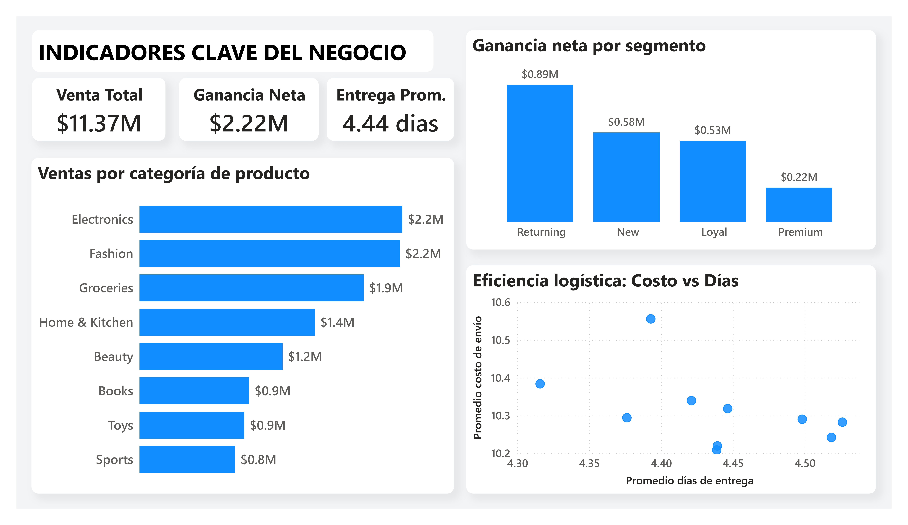
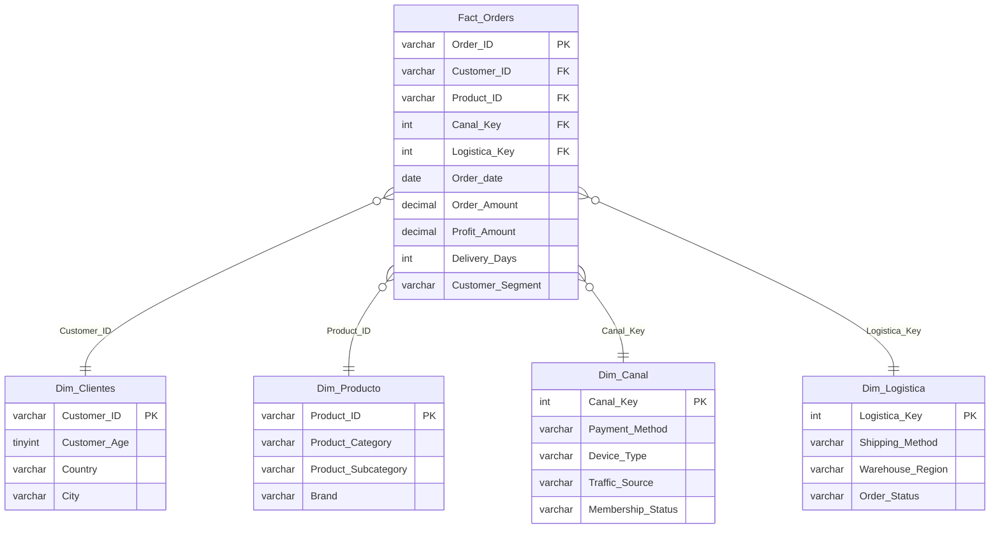

# E-Commerce Supply Chain - De data cruda a decisiones de negocio

Diseño e implementación de un flujo analítico integral: validación de calidad de datos, modelado en estrella en SQL Server y tableros ejecutivos en Power BI, logrando la trazabilidad completa de 30,000 órdenes de e-commerce y la cadena de suministro.


---

## Dashboard




**Hallazgos:**
- **La rentabilidad la sostiene la retención, no la adquisición.** El segmento *Returning* aporta **$0.89M** de ganancia neta (≈40% del total), por encima de clientes *New* ($0.58M), *Loyal* ($0.53M) y *Premium* ($0.22M).
- **La venta está repartida, no concentrada.** *Electronics*, *Fashion* y *Groceries* lideran parejas (~$1.9M–$2.2M cada una), sin una sola categoría dominante.
- **La logística es estable y predecible.** Todas las categorías entregan en una ventana estrecha (≈4.3–4.5 días) con costos de envío similares: no hay un *trade-off* fuerte entre rapidez y costo.

---

## El problema de negocio

La dirección de e-commerce opera sobre una única tabla plana con llaves de negocio corruptas: `Customer_ID` y `Product_ID` reutilizados entre registros distintos. Tomar decisiones sobre datos inconsistentes oculta fugas financieras y distorsiona el cálculo de la rentabilidad real sobre las 30,000 órdenes.

Para eliminar ese riesgo se diseñó e implementó un flujo analítico que transforma la tabla plana en un activo confiable para la toma de decisiones, en tres pasos:

1. Auditoría y limpieza de los datos
2. Modelado dimensional (esquema estrella)
3. Reporte ejecutivo

---

## Modelo dimensional (esquema estrella)



---

## Decisiones de diseño

**1. Auditoría antes de modelar.** Se midió la integridad de las llaves de negocio antes de construir nada: `Customer_ID` resultó 87% inconsistente (mismo ID con distinta edad, género o país) y `Product_ID` 100% inconsistente (mismo ID con distintos atributos).

**2. Resolución de inconsistencias (SCD Tipo 1).** Como las llaves de negocio estaban corruptas, cada cliente y cada producto se resolvió a su registro más reciente (vía `ROW_NUMBER()` particionado por la llave, ordenado por fecha de orden). Con esto se obtuvieron dimensiones limpias de 8,683 clientes y 2,500 productos.

**3. Dimensiones divididas por cohesión de negocio.** Una primera versión agrupó 7 columnas categóricas en una sola dimensión que generaba 12,226 combinaciones. Se dividió en dos dimensiones con sentido:

| Dimensión | Rol | Combinaciones |
|-----------|-----|:-------------:|
| `Dim_Canal` | cómo compra el cliente | **431** |
| `Dim_Logistica` | cómo se entrega la orden | **100** |

Con esto, se pasó de 12,226 a 531 combinaciones totales.

**4. Estrategia de llaves.** Se usa la llave de negocio (`Customer_ID`, `Product_ID`) donde es limpia y única tras deduplicar, y surrogate key (`Canal_Key`, `Logistica_Key`) solo en las dimensiones de combinaciones, que no tienen llave natural.

**5. Revisión post-ETL.** Se validó que `SUM(Order_Amount)` y los conteos coinciden exactamente entre la tabla cruda y el modelo estrella ($11,370,043.99 y 30,000 filas en ambos), garantizando que el ETL no perdió ni duplicó datos.

**6. Generación de vista para BI.** Una vista (`vw_Reporte_Ordenes`) desnormaliza `Fact_Orders` + dimensiones para que Power BI no consulte las tablas base directamente y la estructura del modelo quede intacta.

---

## Notas de transparencia (límites de la fuente)

- **Análisis por categoría de producto:** dado que los atributos de producto son 100% inconsistentes en la fuente, cada producto se resolvió a su categoría *más reciente* (SCD Tipo 1). El gráfico de ventas por categoría refleja esa categoría resuelta, no necesariamente la registrada en cada orden histórica.
- **Demografía del cliente:** resuelta al estado más reciente; la fuente no permite un análisis demográfico histórico profundo confiable.

---

## Estructura del repositorio

```
.
├── README.md
├── sql/
│   ├── 01_auditoria_calidad_datos.sql      # Profiling de la fuente
│   ├── 02_creacion_dim_clientes.sql        # Dimensión de clientes
│   ├── 03_creacion_dim_product.sql         # Dimensión de productos
│   ├── 04_creacion_dim_canal.sql           # Cómo compra el cliente
│   ├── 05_creacion_dim_logistica.sql       # Cómo se entrega
│   ├── 06_creacion_fact_orders.sql         # Tabla de hechos
│   ├── 07_exploracion_tablas_creadas.sql   # Validación
│   ├── 08_auditoria_modelo_estrella.sql    # Verificación
│   └── 09_vista_reporte_ordenes.sql        # Vista para reporte en Power BI
├── powerbi/
│   └── Reporte_ordenes.pbix                 # Reporte de Power BI
└── assets/
    └── dashboard.png                        # Captura del dashboard
```

---

## Cómo reproducirlo

1. Crea la base `Ecom_SupplyChain_DB` en SQL Server.
2. Importa el dataset (ver [Fuente de datos](#fuente-de-datos)) a una tabla llamada `raw_table`.
3. Ejecuta los scripts en orden (del 01 al 09): el 01 diagnostica, del 02 al 06 construyen el modelo, del 07 al 08 validan y el 09 crea la vista.
4. Abre `powerbi/EcomSupplyChain.pbix` y conéctalo a `vw_Reporte_Ordenes`.

**Requisitos:** SQL Server 2019, SSMS 22 y Power BI Desktop.

---

## Fuente de datos

Dataset: **[E-commerce Orders Dataset ]** disponible en [Kaggle](https://www.kaggle.com/datasets/mmumairkhattak/e-commerce-orders-dataset-2026-scra/data?select=ecommerce_orders_notebook.ipynb).
Licencia: **[MIT]**.
Usado con fines educativos y de portafolio.

---

## Autor

**Jesús Muñoz Sánchez** — Ingeniero Industrial & Analista de datos / BI

📧 jesus.3099.jms@gmail.com
🔗 GitHub: [jesus3099jms3099](https://github.com/jesus3099jms3099)
🔗 LinkedIn: [Jesús Muñoz](https://www.linkedin.com/in/jesus-munoz-sanchez/)

